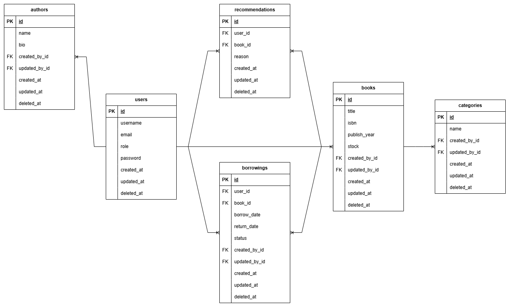

# Implementasi Arsitektur Microservices pada Aplikasi Manajemen Perpustakaan Digital

## 📌 Deskripsi
Aplikasi ini dibangun menggunakan arsitektur berbasis layanan (microservices) yang mencakup beberapa layanan utama seperti autentikasi, manajemen penulis, buku, dan kategori.

## 📁 Struktur Proyek
```
library-api-microservices/
│── assets/               # Berisi aset seperti gambar atau file statis
│── auth-service/         # Layanan autentikasi pengguna
│── author-service/       # Layanan manajemen data penulis
│── book-service/         # Layanan manajemen data buku
│── category-service/     # Layanan manajemen kategori buku
│── nginx/                # Konfigurasi reverse proxy dengan Nginx
|── postman/              # Koleksi request API untuk Postman
│── .gitignore            # File untuk mengecualikan file tertentu dari Git
│── docker-compose.yml    # Konfigurasi untuk menjalankan seluruh layanan dengan Docker Compose
```

## 🚀 Teknologi yang Digunakan
- **Go** - Bahasa pemrograman yang digunakan untuk membangun aplikasi dengan performa tinggi dan dukungan concurrency
- **Fiber** - Framework backend untuk membangun layanan RESTful API
- **gRPC** - Framework komunikasi antarlayanan (service-to-service) yang ringan dan cepat berbasis protokol HTTP/2 dan Protocol Buffers
- **PostgreSQL** - Database SQL untuk penyimpanan data
- **Redis** - Penyimpanan data dalam memori (in-memory store) untuk cache dengan dukungan penguncian untuk mencegah race condition
- **Docker & Docker Compose** - Containerization untuk deployment
- **Nginx** - Reverse proxy untuk mengatur lalu lintas jaringan antar layanan

## 📌 Cara Menjalankan Proyek
### 1. **Prasyarat**
Sebelum menjalankan proyek, pastikan Anda telah menginstal:
- [Docker](https://www.docker.com/get-started)
- [Docker Compose](https://docs.docker.com/compose/install/)

### 2. **Menjalankan Aplikasi**
```bash
docker-compose up --build
```
Perintah di atas akan membangun dan menjalankan seluruh layanan dalam mode container.

### 3. **Menghentikan Aplikasi**
```bash
docker-compose down
```
Perintah ini akan menghentikan dan menghapus semua container yang berjalan.

## 🔍 API Endpoint

### **Auth Service**
| Endpoint                                   | Deskripsi                                     |
|--------------------------------------------|-----------------------------------------------|
| `/auth/login` (POST)                       | Login pengguna                                |
| `/auth/refresh-token` (POST)               | Memperbarui token JWT                         |
| `/users` (POST)                            | Menambahkan pengguna baru                     |
| `/users` (GET)                             | Mendapatkan daftar pengguna                   |
| `/users/:id` (GET)                         | Mendapatkan informasi pengguna berdasarkan ID |
| `/users/:id` (PATCH)                       | Memperbarui informasi pengguna berdasarkan ID |
| `/users/:id` (DELETE)                      | Menghapus pengguna berdasarkan ID             |

### **Author Service**
| Endpoint                                   | Deskripsi                                        |
|--------------------------------------------|--------------------------------------------------|
| `/authors` (POST)                          | Menambahkan penulis baru                         |
| `/authors` (GET)                           | Mendapatkan daftar penulis                       |
| `/authors/:id` (GET)                       | Mendapatkan informasi penulis berdasarkan ID     |
| `/authors/:id` (PATCH)                     | Memperbarui informasi penulis berdasarkan ID     |
| `/authors/:id` (DELETE)                    | Menghapus penulis berdasarkan ID                 |

### **Book Service**  
| Endpoint                                   | Deskripsi                                        |
|--------------------------------------------|--------------------------------------------------|
| `/books` (POST)                            | Menambahkan buku baru                            |
| `/books` (GET)                             | Mendapatkan daftar buku                          |
| `/books/:id` (GET)                         | Mendapatkan informasi buku berdasarkan ID        |
| `/books/:id` (PATCH)                       | Memperbarui informasi buku berdasarkan ID        |
| `/books/:id` (DELETE)                      | Menghapus buku berdasarkan ID                    |
| `/books/increase-stock` (PUT)              | Menambah stok buku                               |
| `/books/decrease-stock` (PUT)              | Mengurangi stok buku                             |
| `/books/borrowings` (GET)                  | Mendapatkan daftar peminjaman buku               |
| `/books/borrowings` (POST)                 | Meminjam buku                                    |
| `/books/borrowings/:id/return` (PUT)       | Mengembalikan buku yang dipinjam                 |
| `/books/recommendations` (POST)            | Menambahkan rekomendasi buku                     |
| `/books/recommendations/:id` (GET)         | Mendapatkan rekomendasi buku berdasarkan ID      |
| `/books/recommendations` (GET)             | Mendapatkan daftar rekomendasi buku              |
| `/books/recommendations/:id` (DELETE)      | Menghapus rekomendasi buku berdasarkan ID        |

### **Category Service**
| Endpoint                                   | Deskripsi                                        |
|--------------------------------------------|--------------------------------------------------|
| `/categories` (POST)                       | Menambahkan kategori buku baru                   |
| `/categories` (GET)                        | Mendapatkan daftar kategori buku                 |
| `/categories/:id` (GET)                    | Mendapatkan informasi kategori berdasarkan ID    |
| `/categories/:id` (PATCH)                  | Memperbarui kategori buku berdasarkan ID         |
| `/categories/:id` (DELETE)                 | Menghapus kategori buku berdasarkan ID           |

## 📊 Entity Relationship Diagram (ERD)

Berikut adalah diagram hubungan entitas untuk sistem yang dibangun:



## 📌 Akses Admin

Untuk keperluan pengujian atau administrasi sistem, akun **admin** telah ditambahkan dengan kredensial berikut:

- **Email**: `admin@admin.com`
- **Password**: `admin123`

Akun admin ini memiliki akses penuh ke semua fitur dalam aplikasi dan dapat digunakan untuk mengelola pengguna, buku, kategori, dan penulis.

Pastikan untuk mengubah kredensial ini jika digunakan dalam lingkungan produksi untuk menjaga keamanan sistem.

## 💁️ Docker Hub Repository
Untuk mempermudah deployment dan distribusi, setiap layanan telah dipush ke Docker Hub. Anda dapat menarik (pull) image terbaru menggunakan perintah berikut:

```bash
# Menarik image untuk masing-masing layanan
docker pull yusufdocker234/auth-service:latest

docker pull yusufdocker234/author-service:latest

docker pull yusufdocker234/book-service:latest

docker pull yusufdocker234/category-service:latest
```

Anda juga dapat mengakses repository di Docker Hub melalui URL berikut:
- [Auth Service](https://hub.docker.com/r/yusufdocker234/auth-service)
- [Author Service](https://hub.docker.com/r/yusufdocker234/author-service)
- [Book Service](https://hub.docker.com/r/yusufdocker234/book-service)
- [Category Service](https://hub.docker.com/r/yusufdocker234/category-service)

---
Jika ada pertanyaan atau masalah, jangan ragu untuk menghubungi saya! 🚀

